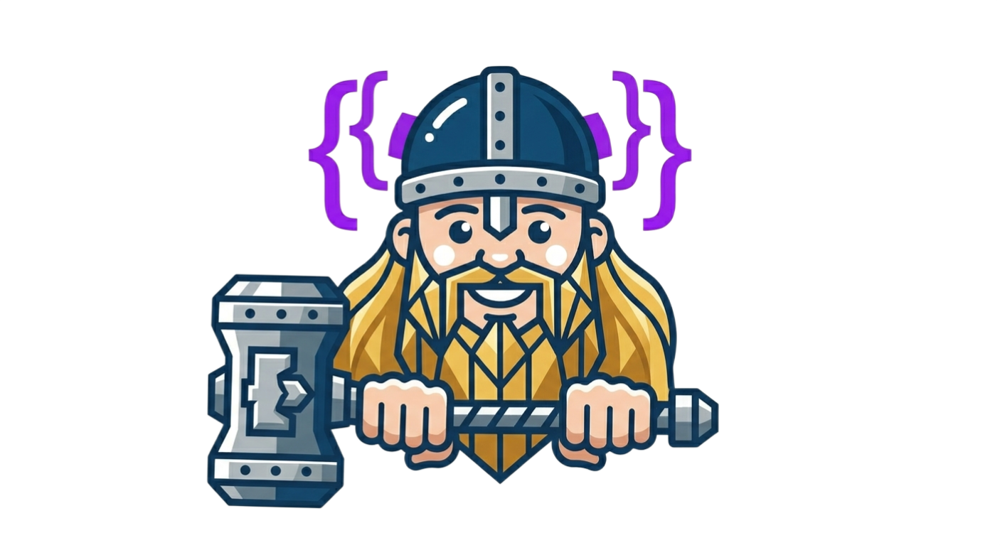
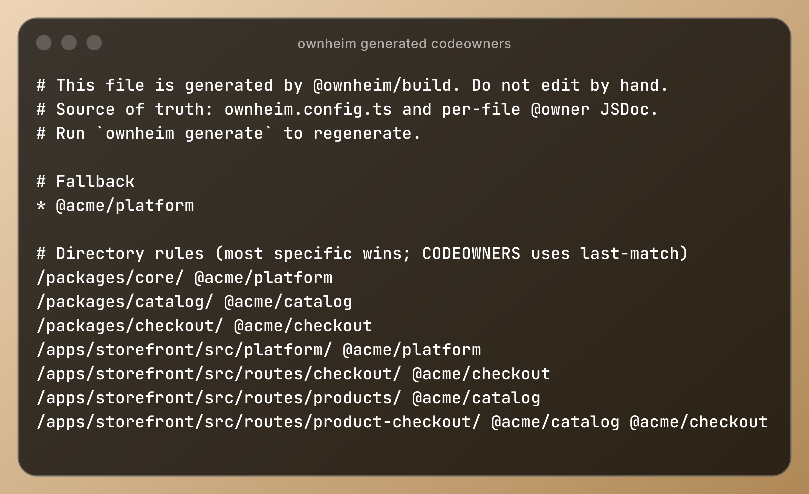

<p align="center">
  
</p>

<h1 align="center">ownheim</h1>

<p align="center">
  <strong>Find a home for every line of code.</strong>
</p>

<p align="center">
  Code-first team ownership for TypeScript monorepos — generate <code>CODEOWNERS</code>, enforce coverage, and attach ownership context to runtime telemetry.
</p>

<p align="center">
  <a href="./LICENSE"></a>
  
  = 18.18" src="https://img.shields.io/badge/Node.js-%3E%3D18.18-339933?style=flat-square&amp;logo=node.js&amp;logoColor=white" />
  
  
</p>

---

## Why Ownheim?

`CODEOWNERS` is useful, but it has a drift problem. Someone adds a package, moves a service, or renames a team, and the ownership file quietly stops matching the repo. Then CI cannot tell you what is uncovered, logs have no team context, and incidents start with the same question: “who owns this?”

Ownheim flips that around. You describe ownership once in TypeScript, generate the repo artifacts from it, and use the same ownership map at runtime.

<table>
  <tr>
    <td width="50%" valign="top">
      <strong>Write ownership like code</strong><br />
      Keep teams, globs, and ownership rules in <code>ownheim.config.ts</code>, where they can be typed, reviewed, and tested.
    </td>
    <td width="50%" valign="top">
      <strong>Generate the files people already use</strong><br />
      Ownheim writes <code>CODEOWNERS</code> and runtime manifests, so GitHub review routing and app telemetry come from the same source.
    </td>
  </tr>
  <tr>
    <td width="50%" valign="top">
      
    </td>
    <td width="50%" valign="top">
      
    </td>
  </tr>
</table>

That gives you a boring, dependable ownership loop:

1. Define owners in `ownheim.config.ts`.
2. Run `ownheim generate` to write `CODEOWNERS` and `.ownheim/ownership.json`.
3. Run `ownheim check` and `ownheim coverage` in CI.
4. Register the manifest in your app so logs, traces, errors, and routes carry team context.

## Install

Install the core package plus the adapters you need:

```bash
bun add @ownheim/core @ownheim/cli

# Optional build-time support
bun add @ownheim/build

# Optional framework adapters
bun add @ownheim/express @ownheim/hono @ownheim/trpc @ownheim/orpc

# Optional observability adapters
bun add @ownheim/datadog @ownheim/otel @ownheim/pino @ownheim/sentry

# Optional lint adapters
bun add @ownheim/eslint @ownheim/oxlint
```

Prefer npm, pnpm, or Yarn? Use the equivalent command for your package manager.

> Ownheim packages are ESM-first TypeScript packages. Use a TypeScript-aware runtime/bundler such as Bun, Vite, esbuild, tsdown, or enable TypeScript import support in your project.

## Quick start

Create `ownheim.config.ts` at the root of your repository:

```ts
import { defineOwnheim } from '@ownheim/core/defineOwnheim';

export default defineOwnheim({
  teams: {
    Accounts: {
      github: '@org/accounts',
      owns: ['packages/accounts/**'],
    },
    Billing: {
      github: '@org/billing',
      owns: ['packages/billing/**'],
    },
  },
});
```

Generate ownership artifacts:

```bash
bunx ownheim generate
```

Add checks to CI:

```bash
bunx ownheim check
bunx ownheim coverage
```

Register the generated runtime manifest once during application startup:

```ts
import { registerOwnershipManifest } from '@ownheim/core/manifest/defaultRegistry';
import manifest from './.ownheim/ownership.json' with { type: 'json' };

registerOwnershipManifest(manifest);
```

## Bundle size and tree-shaking

Ownheim publishes ESM, marks packages as side-effect free, and exposes subpath exports for bundle-sensitive code. Prefer importing the exact module you use:

```ts
import { OwnedError } from '@ownheim/core/OwnedError';
import { runWithEntrypointOwner } from '@ownheim/core/ownership';
import { generateCodeowners } from '@ownheim/build/generateCodeowners';
```

Root imports such as `@ownheim/core` and `@ownheim/build` are convenient for Node/tooling code, but they re-export broader surfaces and can make browser/runtime bundles depend on more modules than necessary. To smoke-test bundle behavior locally, run:

```bash
bun run check:treeshaking
```

## Packages

| Package | Purpose |
| --- | --- |
| `@ownheim/core` | Ownership resolution, scope propagation, logging, and tracing primitives. |
| `@ownheim/cli` | `generate`, `check`, and `coverage` commands. |
| `@ownheim/build` | AST walker, rule resolver, generators, and esbuild plugin. |
| `@ownheim/express` / `@ownheim/hono` | Framework middleware for per-route team tagging. |
| `@ownheim/trpc` / `@ownheim/orpc` | Procedure middleware for ownership-aware RPC telemetry. |
| `@ownheim/pino` / `@ownheim/otel` | Logging and OpenTelemetry ownership adapters. |
| `@ownheim/datadog` / `@ownheim/sentry` | Vendor integrations for team-tagged monitoring. |
| `@ownheim/eslint` / `@ownheim/oxlint` | Rules that prevent ownership drift and manual `CODEOWNERS` edits. |
| `@ownheim/effect` | Effect-TS owner context, decorators, logger, and tracer layers. |

## Learn more

- [Getting started](./docs/getting-started.md)
- [Ownership model](./docs/ownership-model.md)
- [Configuration guide](./docs/configuration.md)
- [Runtime instrumentation](./docs/runtime-instrumentation.md)
- [Package reference](./docs/packages.md)
- [Examples](./docs/examples.md)

## License

MIT
